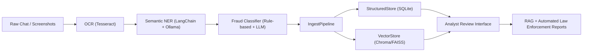

# 🧠 i4g — Intelligence for Good

> *Empowering digital safety through AI-driven scam intelligence.*

---

## 🌍 Overview

**i4g** (Intelligence for Good) is an experimental AI platform designed to detect, analyze, and classify online scams — especially **crypto** and **romance scams targeting seniors**.

It integrates **OCR, LLMs, retrieval-augmented generation (RAG), and structured data pipelines** to transform unstructured chat histories into actionable intelligence for fraud prevention and law enforcement support.

---

## 🎯 Project Vision

The i4g platform aspires to build a complete intelligence lifecycle that:

1. **Analyzes** scam-related communications (chats, screenshots, messages)
2. **Extracts and classifies** key entities, scam types, and patterns
3. **Builds knowledge bases** for analysts and automated systems
4. **Generates structured reports** suitable for law enforcement submission

---

🧩 <strong>System Architecture (click to expand)</strong>

---

## 📚 Documentation

### Planning & Strategy
- 📋 **[Prototype PRD](./docs/prd_prototype.md)** - Original product vision and milestones (M1-M6)
- 🚀 **[Production PRD](./docs/prd_production.md)** - Zero-budget production roadmap with GCP free tier strategy
- 🗺️ **[Development Roadmap](./docs/roadmap.md)** - 8-week task breakdown from prototype to production

### Technical Documentation
- 🏗️ **[System Architecture](./docs/architecture.md)** - High-level system design, deployment, and data flow
- 🔧 **[Technical Design Document](./docs/tdd.md)** - Detailed implementation specs, APIs, and security design
- 💻 **[Developer Guide](./docs/dev_guide.md)** - Setup instructions, development workflow
- ☁️ **[Infrastructure Operations](../infra/README.md)** - Terraform workflow, environment bootstrap, and GCP prerequisites

### Governance & Compliance
- 🔒 **[Data Compliance Guide](./docs/compliance.md)** - PII handling, FERPA/GDPR compliance, incident response

---

## 📄 License

Licensed under the **MIT License**.
All AI-generated components are for educational and research use only.
