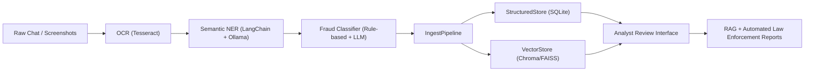

# 🧠 i4g — Intelligence for Good

> *Empowering digital safety through AI-driven scam intelligence.*

---

## 🌍 Overview

**i4g** (Intelligence for Good) is an experimental AI platform designed to detect, analyze, and classify online scams — especially **crypto** and **romance scams targeting seniors**.

It integrates **OCR, LLMs, retrieval-augmented generation (RAG), and structured data pipelines** to transform unstructured chat histories into actionable intelligence for fraud prevention and law enforcement support.

---

## 🎯 Project Vision

The i4g platform aspires to build a complete intelligence lifecycle that:

1. **Analyzes** scam-related communications (chats, screenshots, messages)
2. **Extracts and classifies** key entities, scam types, and patterns
3. **Builds knowledge bases** for analysts and automated systems
4. **Generates structured reports** suitable for law enforcement submission

---

## 🚀 Current Progress

| Milestone | Description | Status |
|------------|-------------|--------|
| **M1** | OCR + Extraction (Tesseract + LangChain + Ollama) | ✅ Completed |
| **M2** | Semantic NER + Structured Entity Extraction | ✅ Completed |
| **M3** | Fraud Classification + Confidence Scoring | ✅ Completed |
| **M4** | Structured & Vector Storage (Database + Chroma Integration) | ✅ Completed |
| **M5** | Analyst Review Interface (Web Dashboard) | ⚙️ Ongoing |
| **M6** | Automated Law Enforcement Report Generation (RAG + Agentic) | ⏳ Next |

---

<details>
<summary>🧩 <strong>System Architecture (click to expand)</strong></summary>


</details>

---

## 🧱 Repository Structure

```
i4g/
├── extraction/         # OCR & NER extraction (Tesseract + LangChain)
├── classification/     # Fraud classification & confidence scoring
├── store/              # Structured & vector data storage modules
│   ├── schema.py
│   ├── structured.py
│   ├── vector.py
│   └── ingest.py
├── rag/                # (Planned) RAG & agentic workflows
├── tests/              # Unit and adhoc tests
│   ├── unit/
│   └── adhoc/
├── docs/
│   ├── prd.md          # Product Requirements Document
│   ├── dev_guide.md    # Developer Guide
│   └── (future) tdd.md # Technical Design Document
└── scripts/            # Production & automation scripts
```

---

## 🧠 Technology Stack

| Layer | Tools / Libraries |
|-------|--------------------|
| OCR | **Tesseract OCR** |
| LLM Framework | **LangChain + Ollama (local models)** |
| Data Storage | **SQLite + Chroma (FAISS-compatible)** |
| ML / AI Pipeline | **Python, NumPy, Scikit-learn, LangChain** |
| Web Interface | *(Planned)* FastAPI + Streamlit |
| Infrastructure | *(Prototype)* Apple Silicon / Local Dev; *(Production)* Linux Cloud GPU |

---

## 🧪 Getting Started (Developers)

```bash
# Clone the repository
git clone https://github.com/<your-org>/i4g.git
cd i4g

# Install dependencies
pip install -e .[dev]

# Run unit tests
pytest tests/unit -v

# Optional: Start Ollama for embeddings
ollama serve
ollama pull nomic-embed-text
```

📘 See the [Developer Guide](./docs/developer_guide.md) for module details, pipeline architecture, and testing strategy.

---

## 🧭 For Product Managers & Advisors

- 📄 [prd.md](./docs/prd.md): Product Requirements Document with personas, use cases, and roadmap.
- 🧠 [dev_guide.md](./docs/developer_guide.md): Engineering overview of ingestion, storage, and data flow.
- 🧩 *(Upcoming)* `tdd.md`: Technical Design Document for production-ready architecture.

> i4g processes only anonymized and voluntarily submitted data, following strong data ethics and compliance principles.

---

## 🗺️ Roadmap Highlights

- [x] OCR, Extraction & Classification (M1–M3)
- [x] Structured & Vector Storage (M4)
- [ ] Analyst Review Dashboard (M5)
- [ ] Automated RAG Report Generation (M6)
- [ ] Cloud Deployment + Law Enforcement API

## 📄 License

Licensed under the **MIT License**.
All AI-generated components are for educational and research use only.
