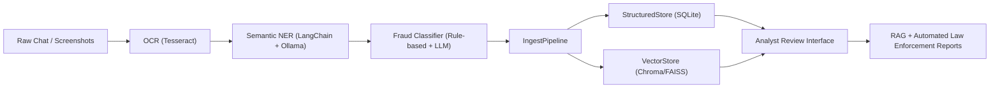

# 🧠 i4g — Intelligence for Good

> *Empowering digital safety through AI-driven scam intelligence.*

---

## 🌍 Overview

**i4g** (Intelligence for Good) is an experimental AI platform designed to detect, analyze, and classify online scams — especially **crypto** and **romance scams targeting seniors**.

It integrates **OCR, LLMs, retrieval-augmented generation (RAG), and structured data pipelines** to transform unstructured chat histories into actionable intelligence for fraud prevention and law enforcement support.

---

## 🎯 Project Vision

The i4g platform aspires to build a complete intelligence lifecycle that:

1. **Analyzes** scam-related communications (chats, screenshots, messages)
2. **Extracts and classifies** key entities, scam types, and patterns
3. **Builds knowledge bases** for analysts and automated systems
4. **Generates structured reports** suitable for law enforcement submission

---

🧩 <strong>System Architecture (click to expand)</strong>

---

## Learn More

- 📄 **[Product Requirements Document](./docs/prd.md)**: For product managers, designers, and anyone interested in the project's vision, user personas, and use cases.
- 🧠 **[Developer Guide](./docs/dev_guide.md)**: For engineers who want to understand the technical architecture, development workflow, and how to contribute to the project.
- 🧩 **[Technical Design Document](./docs/tdd.md)**: (Placeholder) For the future production-ready design and architecture of the system.

---

## 📄 License

Licensed under the **MIT License**.
All AI-generated components are for educational and research use only.
