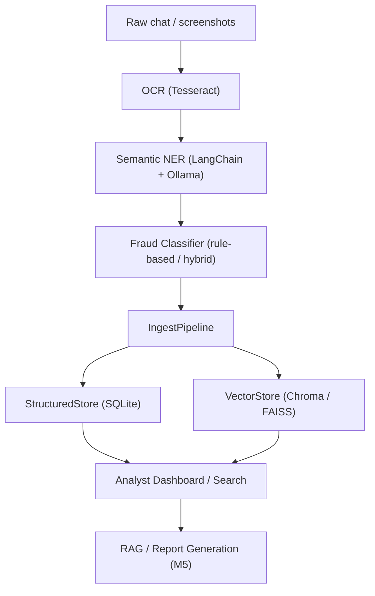

# i4g Developer Guide

> Version: 0.1
> Scope: Storage & Ingestion Subsystem (up to Milestone M4)

---

## Overview

The **i4g** platform (Intelligence for Good) analyzes, classifies, and stores scam-related communications — focusing on crypto and romance scams that disproportionately target seniors.

By **Milestone 4 (M4)**, the project provides a robust ingestion and storage foundation:

1. **Entity extraction** and **fraud classification** (M2–M3)
2. **Validated storage** across structured and semantic vector databases (M4)
3. A unified **ingestion pipeline** connecting the flow from extraction to retrieval

This guide explains how developers can understand, extend, and test the ingestion layer.

---

## Architecture at a Glance



---

## Repository Structure

```
i4g/
├── extraction/         # OCR & NER extraction (Tesseract + LangChain)
├── classification/     # Fraud classification & confidence scoring
├── store/              # Structured & vector data storage modules
│   ├── schema.py
│   ├── structured.py
│   ├── vector.py
│   └── ingest.py
├── rag/                # (Planned) RAG & agentic workflows
├── tests/              # Unit and adhoc tests
│   ├── unit/
│   └── adhoc/
├── docs/
│   ├── prd.md          # Product Requirements Document
│   ├── dev_guide.md    # Developer Guide
│   └── (future) tdd.md # Technical Design Document
└── scripts/            # Production & automation scripts
```

---

## Technology Stack

| Layer | Tools / Libraries |
|-------|--------------------|
| OCR | **Tesseract OCR** |
| LLM Framework | **LangChain + Ollama (local models)** |
| Data Storage | **SQLite + Chroma (FAISS-compatible)** |
| ML / AI Pipeline | **Python, NumPy, Scikit-learn, LangChain** |
| Web Interface | *(Planned)* FastAPI + Streamlit |
| Infrastructure | *(Prototype)* Apple Silicon / Local Dev; *(Production)* Linux Cloud GPU |

---

## Key Components

### ScamRecord (`i4g/store/schema.py`)

Canonical, JSON-serializable record used across the ingestion pipeline.

```python
ScamRecord(
    case_id="case-001",
    text="Hi I'm Anna from TrustWallet...",
    entities={"people": ["Anna"], "wallet_addresses": ["0x..."]},
    classification="crypto_investment",
    confidence=0.91,
)
```

- Methods: `.to_dict()`, `.from_dict()` for persistence.


### StructuredStore (`i4g/store/structured.py`)

SQLite-backed store for structured fields and JSON entities.

**Responsibilities**
- CRUD operations on `ScamRecord`
- Search by field (case_id, classification, confidence, entity keys)
- List recent records (sorted)

**Example**
```python
from i4g.store.structured import StructuredStore

db = StructuredStore("data/i4g_store.db")
records = db.list_recent()
```

### VectorStore (`i4g/store/vector.py`)

Chroma-backed vector store for semantic search. Uses Ollama or other local embedding models.

**Responsibilities**
- Convert text to embeddings
- Add records with metadata
- Semantic similarity queries

**Example**
```python
from i4g.store.vector import VectorStore

vs = VectorStore()
results = vs.query_similar("TrustWallet scam", top_k=3)
```

### IngestPipeline (`i4g/store/ingest.py`)

Bridges classification outputs into both stores.

**Responsibilities**
- Build a `ScamRecord` from classifier output
- Persist to `StructuredStore` and `VectorStore`
- Expose `query_similar_cases(text, top_k)` for quick retrieval

**Example**
```python
from i4g.store.ingest import IngestPipeline

pipeline = IngestPipeline()
case_id = pipeline.ingest_classified_case({
    "text": "Dear John, send BTC to 1FzWL...",
    "fraud_type": "romance_scam",
    "fraud_confidence": 0.9,
    "entities": {"people": [{"value": "John"}]},
})
```

---

## Development Workflow

This project uses `conda` for environment management and `pip-compile` to lock dependencies.

### 1. Environment Setup

Create and activate a `conda` environment.

```bash
# Create a new conda environment
conda create -n i4g python=3.11

# Activate the environment
conda activate i4g
```

### 2. Dependency Management

Project dependencies are defined in `pyproject.toml`. A `requirements.txt` "lock file" is generated from this file to ensure reproducible builds.

```bash
# After activating the conda environment, install dependencies
pip install -r requirements.txt

# If you add a new dependency to pyproject.toml, regenerate the lock file
pip-compile -o requirements.txt pyproject.toml --extra test
```

### 3. Running Tests

The project uses `pytest`. Unit tests are located in `tests/unit/`.

```bash
# Run all unit tests
pytest
```

Ad-hoc and experimental scripts are located in `tests/adhoc/`. See the `tests/adhoc/README.md` for details on how to run them.

---

## Next Steps (M5 Preview)

Milestone 5 will build on M4 and focus on:

- Hybrid retrieval (combine structured + semantic search)
- RAG integration for automated report generation
- Analyst dashboard and case-linking utilities

This current architecture is designed to make the transition smooth.

---

## Reporting Updates

As of Milestone 5, reports are exported as `.docx` files instead of Google Docs. This change improves compatibility and removes the dependency on Google Cloud credentials.