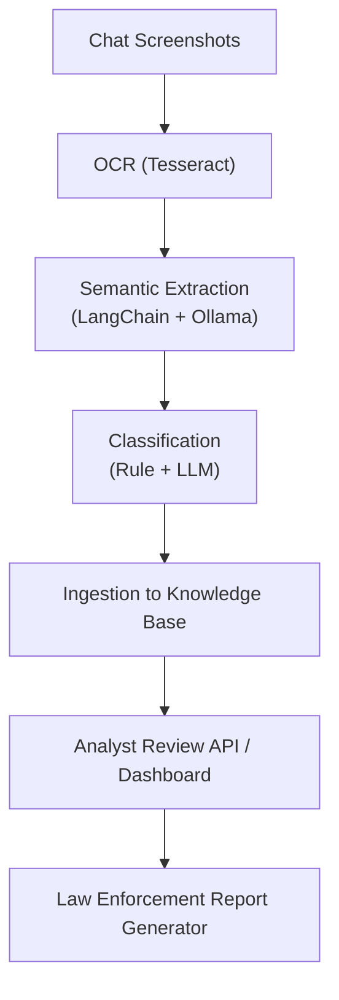

# Developer Guide — Intelligence for Good (i4g)

This Developer Guide explains how to set up, run, and extend the i4g platform — an experimental system for detecting, analyzing, and reporting online scams (especially crypto and romance scams targeting seniors).

---

## System Overview

i4g combines OCR, language models, semantic entity extraction, classification, and human-in-the-loop review to support law enforcement and victim assistance workflows.

### Core Data Flow



---

## Project Layout

```
i4g/
├── src/i4g/
│   ├── ocr/                # OCR via Tesseract
│   ├── extraction/         # NER + Semantic Extraction
│   ├── classification/     # Fraud classifiers
│   ├── embedding/          # Vector embeddings
│   ├── store/              # Vector + Structured + Review DB
│   ├── rag/                # RAG pipeline & retrieval
│   ├── reports/            # Report generation & GDoc export
│   ├── review/             # FastAPI review service
│   ├── worker/             # Background tasks (report gen)
│   └── ...
├── data/                   # Runtime artifacts (bundles, chat_screens, reports, SQLite)
├── tests/
│   ├── unit/
│   └── adhoc/
├── templates/              # Jinja2 report templates
└── scripts/                # Production/admin CLI utilities
```

**Operational vs. Developer Utilities**

- `scripts/`: automation you can run in production or staging (OCR pipeline, semantic extraction, index rebuilds).
- `tests/adhoc/`: developer-only demos, diagnostics, data synthesizers, and lightweight utilities (including context snapshots).

---

## Local Datastore

The `data/i4g_store.db` file is a local SQLite database used for storing application data, including:

-   **Structured Data:** Extracted entities, classification results, and other structured information.
-   **Vector Embeddings:** Embeddings of text for semantic search.
-   **Review Data:** Data for the analyst review system.

This file is created automatically when you run the application and is not meant to be shared or committed to version control. If you want to start with a fresh database, you can delete this file.

---

## Setup Instructions

### Prerequisites

- macOS or Linux (Apple Silicon M3 tested)
- Python ≥ 3.11
- Tesseract OCR installed (`brew install tesseract`)
- Ollama running locally (`ollama serve`)
- FAISS (for vector store)
- Optional: Google Cloud SDK (for GDoc export)

### Environment Setup

```bash
git clone https://github.com/jsoung/i4g.git
cd i4g
python3 -m venv .venv
source .venv/bin/activate
pip install -U pip
pip install -e .
pip install pre-commit

# Optional: install the shared pre-commit hook for formatting + unit tests
ln -sf ../../scripts/git-hooks/pre-commit .git/hooks/pre-commit
pre-commit run --all-files  # prime caches on first install
```

To test your setup:

```bash
pytest -q
```

## Configuration

i4g services load configuration through `i4g.settings`, which is powered by
[Pydantic settings](https://docs.pydantic.dev/latest/usage/pydantic_settings/).
Values are resolved in the following order:

1. Defaults declared in the `Settings` model.
2. Project-level `.env`.
3. Environment-specific `.env.<env>` (e.g. `.env.staging`).
4. Local overrides in `.env.local` (ignored by git).
5. Direct environment variables (`I4G_*`).

The active environment is selected via `I4G_ENV` (defaults to `local`). All
services—including Streamlit, FastAPI, and CLI tools—should read configuration
via `get_settings()` instead of accessing environment variables directly.

### Sample local override

```
# .env.local
I4G_ENV=local
I4G_API_URL=http://127.0.0.1:8000
I4G_API_KEY=dev-analyst-token
I4G_VECTOR_BACKEND=chroma
```

To inspect the effective configuration:

```bash
python -c "from i4g.settings import get_settings; print(get_settings())"
```

### Nested settings reference

`i4g.settings` now groups related configuration into typed sections so we can swap individual services (local versus GCP) without flipping the entire environment. The most frequently used sections are:

| Section | Purpose | Common overrides |
| --- | --- | --- |
| `settings.api` | FastAPI/CLI endpoints and shared API key | `I4G_API__BASE_URL`, `I4G_API__KEY` |
| `settings.storage` | Structured store backend and Cloud Storage buckets | `I4G_STORAGE__STRUCTURED_BACKEND`, `I4G_STORAGE__SQLITE_PATH`, `I4G_STORAGE__EVIDENCE_BUCKET` |
| `settings.vector` | Vector index backend and embedding model | `I4G_VECTOR__BACKEND`, `I4G_VECTOR__CHROMA_DIR`, `I4G_VECTOR__PGVECTOR__DSN` |
| `settings.llm` | Chat/RAG model provider selection | `I4G_LLM__PROVIDER`, `I4G_LLM__OLLAMA_BASE_URL`, `I4G_LLM__VERTEX_AI__MODEL` |
| `settings.identity` | Auth provider wiring for Streamlit + APIs | `I4G_IDENTITY__PROVIDER`, `I4G_IDENTITY__AUDIENCE` |
| `settings.ingestion` | Scheduler + Cloud Run job defaults | `I4G_INGESTION__ENABLE_SCHEDULED_JOBS`, `I4G_INGESTION__SERVICE_ACCOUNT` |

Use double underscores to drill into nested fields (for example `I4G_STORAGE__EVIDENCE_BUCKET=i4g-evidence-staging`). Legacy aliases like `I4G_API_URL` and `I4G_VECTOR_BACKEND` still work, so existing `.env` files do not need to change immediately.


## Running the Core Pipelines

There are also targeted demos under `tests/adhoc/` if you want to exercise a single feature (OCR, extraction, reporting, etc.); check the README in that folder for usage details.

## Restoring Sample Data & Artifacts

If you cleaned out the `data/` directory (or are onboarding to a fresh clone), start with the consolidated helper below to rebuild everything in one step:

```bash
python scripts/bootstrap_local_sandbox.py --reset
```

This command orchestrates the bundle builder, screenshot synthesis, OCR, semantic extraction, manual ingest demo, and review-case seeding. It automatically adds the project `src/` folder to `PYTHONPATH`, so running from an editable install (`pip install -e .`) is optional. If Tesseract is missing it falls back to the downstream steps and prints a reminder—you can rerun with `--skip-ocr` if you plan to install OCR tooling later.

Prefer a manual walkthrough or need to re-run a single stage? Use the individual helpers below.

1. **Download + Normalize Scam Text Bundles**

    ```bash
    python tests/adhoc/build_scam_bundle.py --outdir data/bundles --chunk_chars 800
    ```

    This pulls public-domain scam/phishing corpora via Hugging Face, masks obvious PII, and writes JSONL bundles such as `data/bundles/ucirvine_sms.jsonl` and `data/bundles/bundle_all.jsonl`.

2. **Synthesize Chat Screenshots for OCR Demos**

    ```bash
    python tests/adhoc/synthesize_chat_screenshots.py --input data/bundles/ucirvine_sms.jsonl --limit 20
    ```

    Generated PNGs land in `data/chat_screens/`. That folder is the expected input directory for the OCR script, so you can immediately run:

    ```bash
    python scripts/run_ocr.py --input data/chat_screens
    ```

3. **Reprime SQLite / Vector Stores (optional)**

    ```bash
    python tests/adhoc/manual_ingest_demo.py
    ```

    This seeds `data/manual_demo/` with a structured SQLite DB and a Chroma vector index using two representative scam cases. Rerun as needed whenever you want a clean slate for ingestion demos.

4. **Seed Analyst Review Queue**

    ```bash
    python tests/adhoc/synthesize_review_cases.py --reset --queued 5 --in-review 2 --accepted 1 --rejected 1
    ```

    Populates `data/i4g_store.db` with synthetic review items so the Streamlit dashboard has cases ready to demonstrate claim/accept/reject flows.

Once these assets exist, the downstream scripts referenced below will find usable inputs without manual data hunting.

### Hugging Face API Tokens

Some ad-hoc scripts (for example `tests/adhoc/hf_embedding.py`) call the Hugging Face Inference API. Create a personal access token at <https://huggingface.co/settings/tokens> and expose it before running those scripts:

```bash
export HF_API_TOKEN=hf_xxx    # put this in your shell profile if you use it often
python tests/adhoc/hf_embedding.py "Sample text to embed"
```

Without the token, the API returns `401 Invalid credentials`.

### OCR + Extraction

```bash
python scripts/run_ocr.py --input data/chat_screens
```

That path is where the synthetic screenshots land; swap in another directory if you are running OCR on real evidence.

### Semantic NER + Classification

```bash
python scripts/run_semantic_extraction.py
python tests/adhoc/classify_text.py "This looks like a scam."
```

`run_semantic_extraction.py` reads the OCR output saved to `data/ocr_output.json` by the previous step and writes enriched entities to `data/entities_semantic.json`.

### Scam Detection RAG Query

```bash
i4g-admin query --question "Is this a crypto scam?"
```

---

## Analyst Review System

### Backend API

Run the review backend:

```bash
uvicorn i4g.api.app:app --reload
```

Check endpoint:
```
http://localhost:8000/docs
```

### Streamlit Analyst Dashboard

```bash
streamlit run tests/adhoc/analyst_dashboard_demo.py
```

Note: If Streamlit fails to import protobuf with an error like "Descriptors cannot be created directly", pin protobuf to a 4.x release before launching Streamlit. For example:

```bash
pip install 'protobuf>=4.21.0,<5.0'
```

For full dashboard functionality (API-backed), you can run the main UI:

```bash
streamlit run src/i4g/ui/analyst_dashboard.py

Developer note: dependency resolution

`requirements.txt` is generated with `pip-compile --extra=test pyproject.toml`. Thanks to the `protobuf>=5,<6` pin, the resolver should converge without manual edits. Run the command inside the `i4g` conda environment so the right interpreter is on PATH, and commit both `pyproject.toml` and `requirements.txt` when you intentionally update dependencies.
```

**Streamlit Analyst Dashboard**

- **Seed data first:** `python tests/adhoc/synthesize_review_cases.py --reset --queued 5` so the queue has items to triage.
- **Launch UI:** `streamlit run tests/adhoc/analyst_dashboard_demo.py` (full workflow for claiming, accepting, and rejecting cases).
- **Search faster:** blend vector + structured lookups, adjust result counts, and paginate without re-running queries; hits tally shows total coverage.
- **Saved search controls:** tag-based grouping, quick presets, CSV export, rename/share/delete, and bulk tag edits directly in the sidebar.
- **Audit trail:** every run lands in `/reviews/search/history`; preview previous runs or replay them from the recent history panel.

---

## Report Generation

### Manual Report Preview

```bash
python tests/adhoc/manual_report_demo.py
```

### GDoc Export (if Google API configured)

```bash
python tests/adhoc/manual_report_export_demo.py
```

Generated `.docx` files are written to `data/reports/` whether you trigger them from the demos, the Streamlit dashboard, or the API.

---

## Developer Utilities

**Core Scripts**

- **Build FAISS index:** `python scripts/build_index.py --backend faiss --reset`
- **Run unit tests:** `pytest -v`
- **Format source:** `black src tests`
- **Snapshot context:** `bash tests/adhoc/generate_context_snapshot.sh --help`
- **Install git hook:** `ln -sf ../../scripts/git-hooks/pre-commit .git/hooks/pre-commit`
- **First hook run:** `pre-commit run --all-files`

> ⚠️ Run commits from an activated `i4g` environment (or set `CONDA_PREFIX`/`VIRTUAL_ENV`) so the hook uses the correct Python when executing unit tests.
> Formatter line length is set to 120 characters to match team editor settings.

**Saved Search Admin (`i4g-admin`)**

- `i4g-admin export-saved-searches --owner alice --output alice.json`
- `i4g-admin import-saved-searches --shared --input team.json`
- `i4g-admin bulk-update-tags --owner alice --tags urgent wallet --remove legacy`
- `i4g-admin prune-saved-searches --owner alice --tags legacy`

Install locally with `pip install -e .` to expose `i4g-admin` everywhere; run `i4g-admin --help` to browse each subcommand.

---

## Notes for Cloud Deployment

- Production environment expected to run on Linux (GCP or AWS).
- Review API and worker tasks should run as services.
- GDoc exporter requires Google service account credentials.
- Use `docker/` folder for containerized deployment (optional).
