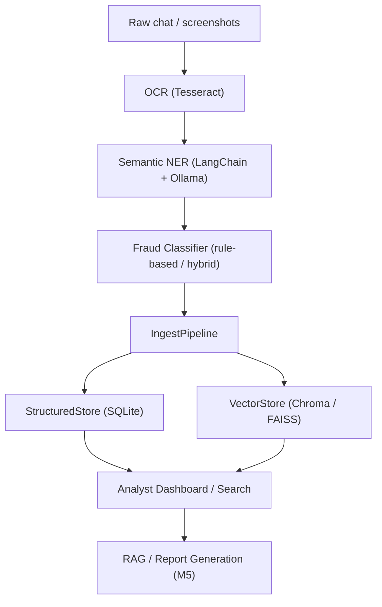

# i4g Developer Guide

> Version: 0.1
> Scope: Storage & Ingestion Subsystem (up to Milestone M4)

---

## Overview

The **i4g** platform (Intelligence for Good) analyzes, classifies, and stores scam-related communications — focusing on crypto and romance scams that disproportionately target seniors.

By **Milestone 4 (M4)**, the project provides a robust ingestion and storage foundation:

1. **Entity extraction** and **fraud classification** (M2–M3)
2. **Validated storage** across structured and semantic vector databases (M4)
3. A unified **ingestion pipeline** connecting the flow from extraction to retrieval

This guide explains how developers can understand, extend, and test the ingestion layer.

---

## Architecture at a Glance



---

## Folder Layout (Core)

```
i4g/
├── store/
│   ├── schema.py         # ScamRecord dataclass
│   ├── structured.py     # SQLite-based metadata store
│   ├── vector.py         # Chroma semantic store
│   └── ingest.py         # Unified ingestion pipeline
├── extraction/           # Semantic NER (Tesseract + LLM)
├── classification/       # Fraud classifier + confidence
└── rag/                  # (To be implemented in M5)
```

---

## Key Components

### ScamRecord (`i4g/store/schema.py`)

Canonical, JSON-serializable record used across the ingestion pipeline.

```python
ScamRecord(
    case_id="case-001",
    text="Hi I'm Anna from TrustWallet...",
    entities={"people": ["Anna"], "wallet_addresses": ["0x..."]},
    classification="crypto_investment",
    confidence=0.91,
)
```

- Methods: `.to_dict()`, `.from_dict()` for persistence.


### StructuredStore (`i4g/store/structured.py`)

SQLite-backed store for structured fields and JSON entities.

**Responsibilities**
- CRUD operations on `ScamRecord`
- Search by field (case_id, classification, confidence, entity keys)
- List recent records (sorted)

**Example**
```python
from i4g.store.structured import StructuredStore

db = StructuredStore("data/i4g_store.db")
records = db.list_recent()
```

### VectorStore (`i4g/store/vector.py`)

Chroma-backed vector store for semantic search. Uses Ollama or other local embedding models.

**Responsibilities**
- Convert text to embeddings
- Add records with metadata
- Semantic similarity queries

**Example**
```python
from i4g.store.vector import VectorStore

vs = VectorStore()
results = vs.query_similar("TrustWallet scam", top_k=3)
```

### IngestPipeline (`i4g/store/ingest.py`)

Bridges classification outputs into both stores.

**Responsibilities**
- Build a `ScamRecord` from classifier output
- Persist to `StructuredStore` and `VectorStore`
- Expose `query_similar_cases(text, top_k)` for quick retrieval

**Example**
```python
from i4g.store.ingest import IngestPipeline

pipeline = IngestPipeline()
case_id = pipeline.ingest_classified_case({
    "text": "Dear John, send BTC to 1FzWL...",
    "fraud_type": "romance_scam",
    "fraud_confidence": 0.9,
    "entities": {"people": [{"value": "John"}]},
})
```

---

## Testing Strategy

| Type | Location | Description |
|------|-----------|-------------|
| **Unit Tests** | `tests/unit/` | Automated pytest suite for schema, structured, vector, ingest modules. Use mocks to keep tests deterministic. |
| **Adhoc Tests** | `tests/adhoc/` | Manual developer scripts for end-to-end smoke tests using real Ollama + Chroma. |

Run unit tests:

```bash
pytest tests/unit -v
```

Run manual ingestion demo (developer-only):

```bash
python tests/adhoc/manual_ingest_demo.py
```

---

## Developer Workflow Tips

1. **Development Setup**

```bash
pip install -e .[dev]
ollama serve
ollama pull nomic-embed-text  # or your preferred embedding model
```

2. **Storage Inspection**
- SQLite DB files live under `data/*.db`.
- Chroma vector store lives under `data/chroma/`.

3. **Reset Test Data**
```bash
rm -rf data/chroma data/*.db
```

4. **Performance Notes**
- Ollama embeddings are CPU-friendly on Apple Silicon for small-to-medium data.
- Chroma scales locally to thousands of vectors; for larger scale consider FAISS/Milvus.

---

## Next Steps (M5 Preview)

Milestone 5 will build on M4 and focus on:

- Hybrid retrieval (combine structured + semantic search)
- RAG integration for automated report generation
- Analyst dashboard and case-linking utilities

This current architecture is designed to make the transition smooth.
