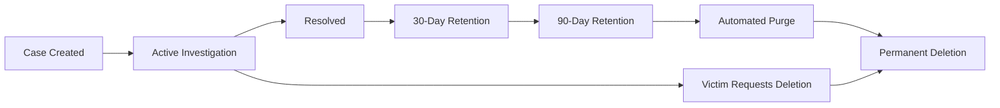
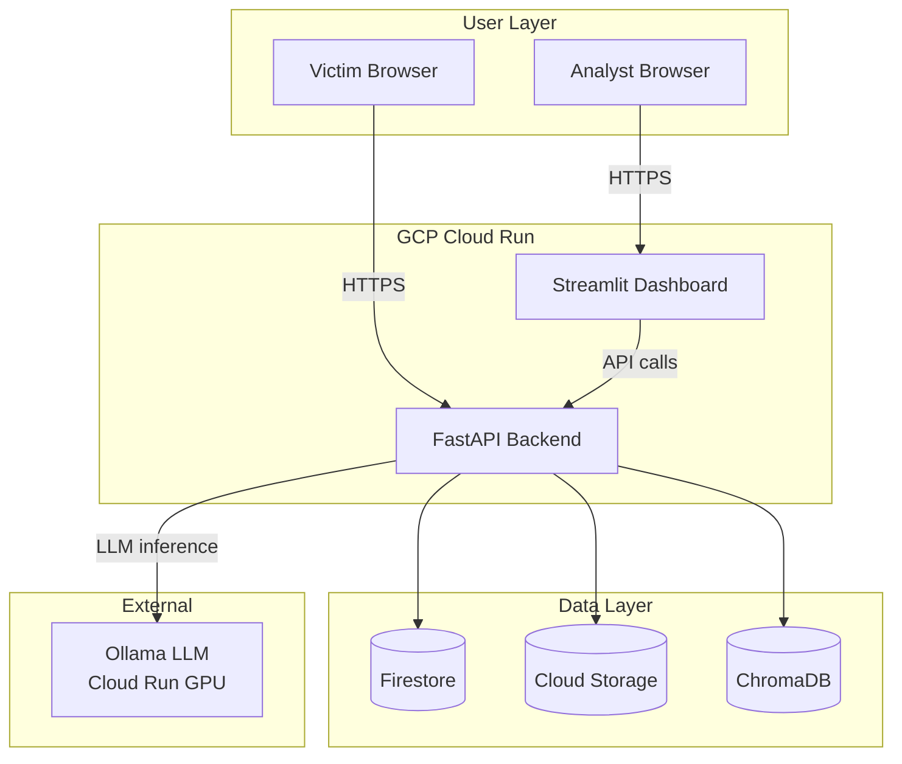

# Product Requirements Document: i4g Production System

> **Document Version**: 1.0
> **Last Updated**: October 30, 2025
> **Owner**: Jerry Soung
> **Status**: Planning → MVP Development

---

## Executive Summary

**i4g (Intelligence for Good)** is transitioning from a functional prototype to a production-ready platform that helps scam victims document fraud and generate law enforcement reports. This PRD outlines the requirements for a **zero-budget production deployment** using Google Cloud Platform's free tier, with a focus on **PII protection, volunteer scalability, and partnership readiness**.

**Timeline**: 8 weeks @ 10 hours/week = 80 hours total
**Deployment Target**: GCP Cloud Run (serverless, auto-scaling)
**Success Metric**: 12 active volunteer analysts processing 200+ cases within 4 months

---

## Problem Statement

**Current State (Prototype)**:
- ✅ Functional RAG pipeline with LangChain + Ollama
- ✅ SQLite database with 69 passing unit tests
- ✅ Streamlit dashboard for analyst review
- ✅ Basic scam classification (romance, crypto, phishing)

**Gaps Preventing Production Use**:
- ❌ **No PII protection**: Raw SSNs, bank accounts visible to analysts
- ❌ **No authentication**: Anyone can access the dashboard
- ❌ **Local-only**: Runs on Jerry's laptop (not accessible to volunteers)
- ❌ **No monitoring**: Can't detect failures or track usage
- ❌ **No compliance**: FERPA, GDPR requirements unmet
- ❌ **No scalability**: SQLite doesn't support concurrent writes

---

## Goals & Success Criteria

### Phase 1: MVP (Weeks 1-4)
**Goal**: Secure, monitored API deployed to GCP Cloud Run

| Metric | Target | Measurement |
|--------|--------|-------------|
| System Uptime | 95%+ | Cloud Monitoring |
| PII Leakage | 0 incidents | Audit logs |
| Authentication | 100% OAuth | No anonymous access |
| Test Coverage | ≥80% | pytest-cov |
| Infrastructure Cost | $0 | GCP billing dashboard |

### Phase 2: Beta Launch (Weeks 5-8)
**Goal**: 3 volunteer analysts onboarded and processing real cases

| Metric | Target | Measurement |
|--------|--------|-------------|
| Active Analysts | 3+ | Firestore /analysts collection |
| Cases Processed | 50+ | Firestore /cases collection |
| False Positive Rate | <20% | Manual review |
| Analyst NPS | ≥8/10 | Post-beta survey |

### Phase 3: Partnership Readiness (Months 3-6)
**Goal**: Pitch-ready for university and AARP partnerships

| Metric | Target | Measurement |
|--------|--------|-------------|
| Active Analysts | 12+ | Firestore |
| Cases Processed | 200+ | Analytics dashboard |
| LEO Reports Generated | 10+ | PDF exports |
| Funding Secured | $10K+ | Grant applications |

---

## User Personas

### 1. **Scam Victim** (Primary End User)
- **Demographics**: 65+ years old, limited technical literacy
- **Pain Points**:
  - Overwhelmed by evidence collection (emails, screenshots, receipts)
  - Fear of sharing personal information online
  - Difficulty articulating fraud to law enforcement
- **Goals**:
  - Simple upload process (drag-and-drop)
  - Confidence that PII is protected
  - Professional police report for filing

**User Journey**:
1. Victim visits `i4g.org/report`
2. Uploads evidence (emails, screenshots, bank statements)
3. System automatically extracts PII and tokenizes
4. Receives confirmation email with case ID
5. Analyst reviews and approves case (1-3 days)
6. Victim receives PDF police report via secure link

---

### 2. **Volunteer Analyst** (Secondary User)
- **Demographics**: Graduate students (criminology, data science), retired professionals
- **Skills**: Basic investigative skills, detail-oriented, empathetic
- **Pain Points**:
  - Needs FERPA training (if university-affiliated)
  - Limited time (10 hours/week)
  - Wants to help but fears legal liability
- **Goals**:
  - Clear case review workflow
  - No exposure to raw PII (tokenized display)
  - Recognition for volunteer work (letters of recommendation)

**User Journey**:
1. Analyst signs in with Google (OAuth)
2. Sees dashboard with assigned cases
3. Reviews evidence (PII masked as `███████`)
4. Adds notes, marks scam type
5. Approves case → system generates LEO report
6. Tracks impact metrics (cases closed, $ recovered)

---

### 3. **Law Enforcement Officer** (Tertiary User)
- **Demographics**: Detectives in financial crimes units
- **Pain Points**:
  - Receives poorly documented victim reports
  - Lacks technical expertise to analyze crypto transactions
  - Case backlog (hundreds of open fraud cases)
- **Goals**:
  - Standardized report format (court-admissible)
  - Digital evidence chain of custody
  - Batch export for multi-victim cases

**User Journey**:
1. Victim brings i4g-generated report to police station
2. LEO validates report authenticity (digital signature)
3. Accesses evidence files via secure portal (with subpoena if needed)
4. Downloads batch export for organized crime investigation

---

## Functional Requirements

### FR-1: PII Tokenization (P0 - Critical Path)
**Requirement**: All personally identifiable information (PII) must be tokenized immediately upon upload and stored separately from case data.

**Acceptance Criteria**:
- [ ] System detects PII using regex patterns (SSN, email, phone, credit card, address, DOB)
- [ ] LLM-assisted PII extraction for contextual patterns (e.g., "my social security number is...")
- [ ] PII encrypted with AES-256-GCM before storage in Firestore `/pii_vault` collection
- [ ] Case data contains only tokens (e.g., `<PII:SSN:7a8f2e>`)
- [ ] Analysts see masked PII (e.g., `███████`) in dashboard
- [ ] LEO reports reconstruct real PII only with victim consent

**Implementation Notes**:
```python
# Example tokenization flow
text = "My SSN is 123-45-6789"
pii_detector = PIIDetector()
tokens = pii_detector.tokenize(text)
# Returns: {"ssn": "<PII:SSN:7a8f2e>"}

# Stored in Firestore /cases
{"description": "My SSN is <PII:SSN:7a8f2e>"}

# Stored in Firestore /pii_vault (encrypted)
{"token": "7a8f2e", "value": "AES-256-GCM encrypted"}
```

**Dependencies**: None (foundational requirement)
**Effort**: 6 hours (regex patterns + encryption layer)

---

### FR-2: OAuth 2.0 Authentication (P0 - Critical Path)
**Requirement**: Only approved analysts can access the dashboard and case data.

**Acceptance Criteria**:
- [ ] "Sign in with Google" button on dashboard homepage
- [ ] OAuth 2.0 flow using Google Identity Platform
- [ ] JWT token stored in session (expires in 1 hour)
- [ ] Firestore security rules enforce `/cases` access based on `assigned_to` field
- [ ] Admin role can approve new analysts via `/api/analysts/{uid}/approve` endpoint

**User Roles**:
| Role | Permissions |
|------|-------------|
| `victim` | View/edit own case only |
| `analyst` | View assigned cases, add notes |
| `admin` | View all cases, manage analysts |
| `leo` | Download reports with subpoena |

**Implementation Notes**:
```python
from fastapi import Depends, HTTPException
from fastapi.security import OAuth2PasswordBearer

oauth2_scheme = OAuth2PasswordBearer(tokenUrl="token")

async def get_current_user(token: str = Depends(oauth2_scheme)):
    user = verify_jwt(token)
    if not user:
        raise HTTPException(status_code=401)
    return user
```

**Dependencies**: FR-1 (PII vault must be isolated)
**Effort**: 4 hours (Google OAuth + Firestore rules)

---

### FR-3: Cloud Run Deployment (P0 - Critical Path)
**Requirement**: Deploy FastAPI backend and Streamlit dashboard to GCP Cloud Run for public access.

**Acceptance Criteria**:
- [ ] Dockerfile builds successfully (`docker build -t i4g-api .`)
- [ ] Image pushed to Google Container Registry (`gcr.io/i4g-prod/api:latest`)
- [ ] Cloud Run service deployed with HTTPS endpoint (`https://api.i4g.org`)
- [ ] Auto-scaling: 0 → 10 instances based on traffic
- [ ] Environment variables (API keys, DB connection) stored in Secret Manager
- [ ] Health check endpoint (`/api/health`) returns 200 OK

**GCP Free Tier Limits**:
- 2M requests/month
- 360K vCPU-seconds/month
- 180K GiB-seconds memory/month
- **Cost**: $0 within free tier

**Implementation Notes**:
```dockerfile
FROM python:3.11-slim
WORKDIR /app
COPY requirements.txt .
RUN pip install --no-cache-dir -r requirements.txt
COPY src/ .
CMD ["uvicorn", "i4g.api.app:app", "--host", "0.0.0.0", "--port", "8080"]
```

```bash
gcloud run deploy i4g-api \
  --image gcr.io/i4g-prod/api:latest \
  --region us-central1 \
  --allow-unauthenticated \
  --max-instances 10 \
  --memory 1Gi
```

**Dependencies**: FR-1, FR-2 (security must be in place)
**Effort**: 3 hours (Dockerfile + gcloud deployment)

---

### FR-4: Structured Logging & Monitoring (P0 - Must Have)
**Requirement**: Track system health, errors, and security events.

**Acceptance Criteria**:
- [ ] All logs in JSON format with correlation IDs
- [ ] Log levels: DEBUG, INFO, WARNING, ERROR, CRITICAL
- [ ] Cloud Logging integration (automatically collected from Cloud Run)
- [ ] Custom metrics: `/pii_vault` access count, classification accuracy, API latency
- [ ] Alerting policies: Error rate >5% for 5 minutes, latency p95 >2 seconds

**Log Schema**:
```json
{
  "timestamp": "2025-10-30T12:00:00Z",
  "severity": "INFO",
  "correlation_id": "uuid-v4",
  "user_id": "analyst_uid_123",
  "action": "case_approved",
  "case_id": "case_uuid",
  "metadata": {
    "classification": "Romance Scam",
    "confidence": 0.92
  }
}
```

**Monitoring Dashboard**:
- System uptime (99%+ target)
- Request rate (requests/second)
- Error rate (5xx responses)
- PII vault access (detect anomalies)

**Dependencies**: FR-3 (Cloud Run must be deployed)
**Effort**: 3 hours (structured logging + Cloud Monitoring setup)

---

### FR-5: Analyst Dashboard (P1 - High Priority)
**Requirement**: Streamlit UI for case review with PII masking.

**Acceptance Criteria**:
- [ ] OAuth login screen (Google Sign-In)
- [ ] Case list view (sortable by date, status, scam type)
- [ ] Case detail view with evidence thumbnails
- [ ] PII masked as `███████` (tooltip shows token ID for debugging)
- [ ] Notes section (markdown support)
- [ ] Bulk operations: Assign multiple cases, export CSV
- [ ] Mobile-responsive design (works on tablets)

**UI Mockup** (text-based):
```
┌─────────────────────────────────────────┐
│ i4g Analyst Dashboard                   │
│ Logged in as: jane@university.edu       │
├─────────────────────────────────────────┤
│ Assigned Cases (12)                     │
│                                         │
│ ┌─────────────────────────────────────┐ │
│ │ Case \#1234 - Romance Scam          │ │
│ │ Victim: ███████ (@gmail.com)        │ │
│ │ Amount Lost: $10,000                │ │
│ │ Status: Pending Review              │ │
│ │ [View Details] [Approve]            │ │
│ └─────────────────────────────────────┘ │
│                                         │
│ ┌─────────────────────────────────────┐ │
│ │ Case \#1235 - Crypto Scam           │ │
│ │ Victim: ███████ (@outlook.com)      │ │
│ │ Amount Lost: $5,000                 │ │
│ │ Status: In Progress                 │ │
│ │ [View Details]                      │ │
│ └─────────────────────────────────────┘ │
└─────────────────────────────────────────┘
```

**Dependencies**: FR-1 (PII tokenization), FR-2 (OAuth)
**Effort**: 4 hours (Streamlit UI + PII masking logic)

---

### FR-6: Automated Testing (P1 - High Priority)
**Requirement**: Comprehensive test suite to prevent regressions.

**Acceptance Criteria**:
- [ ] Unit test coverage ≥80%
- [ ] Integration tests for critical paths (upload → classify → review → report)
- [ ] E2E tests using pytest-playwright (optional)
- [ ] Tests run in GitHub Actions on every PR
- [ ] Pre-commit hooks for linting (black, isort, mypy)

**Test Structure**:
```
tests/
├── unit/
│   ├── test_pii_tokenizer.py       # FR-1 tests
│   ├── test_auth.py                # FR-2 tests
│   ├── test_classification.py      # RAG pipeline tests
│   └── test_report_generation.py   # PDF export tests
├── integration/
│   ├── test_case_workflow.py       # Upload → classify → approve
│   └── test_firestore_operations.py
└── e2e/
    └── test_dashboard_flow.py      # Login → review case → approve
```

**CI Pipeline** (GitHub Actions):
```yaml
name: CI
on: [push, pull_request]
jobs:
  test:
    runs-on: ubuntu-latest
    steps:
      - uses: actions/checkout@v3
      - uses: actions/setup-python@v4
        with:
          python-version: '3.11'
      - run: pip install -e ".[dev]"
      - run: pytest tests/ --cov=src/i4g --cov-report=xml
      - run: black --check src/ tests/
      - run: mypy src/
```

**Dependencies**: None (can be developed in parallel)
**Effort**: 6 hours (integration tests + CI setup)

---

### FR-7: LEO Report Generation (P2 - Nice to Have)
**Requirement**: Generate PDF reports suitable for law enforcement submission.

**Acceptance Criteria**:
- [ ] PDF format (replacing current .docx)
- [ ] Standardized template: Header, victim info, scammer info, timeline, evidence links
- [ ] Digital signature (hash + timestamp for authenticity)
- [ ] Batch export (multiple cases for organized crime investigation)
- [ ] Downloadable from `/api/cases/{case_id}/report.pdf`

**Report Template** (text preview):
```
────────────────────────────────────────
       i4g LAW ENFORCEMENT REPORT
────────────────────────────────────────
Case ID: 1234
Generated: 2025-10-30 12:00:00 UTC
Analyst: Jane Doe (jane@university.edu)

VICTIM INFORMATION:
  Name: [REDACTED - See PII Vault]
  Email: victim@example.com
  Phone: [REDACTED]

SCAM CLASSIFICATION:
  Type: Romance Scam
  Confidence: 92%
  AI Model: llama3.1 (Ollama)

FINANCIAL LOSS:
  Amount: $10,000 USD
  Transaction Method: Wire transfer
  Recipient: [Bank details in evidence]

TIMELINE:
  2025-09-15: First contact on dating app
  2025-09-20: Scammer requests financial help
  2025-09-25: Victim sends $10,000
  2025-09-30: Scammer stops responding

EVIDENCE FILES:
  - chat_transcript.pdf (Cloud Storage: gs://...)
  - wire_transfer_receipt.pdf
  - dating_profile_screenshot.png

ANALYST NOTES:
  Verified wire transfer receipt. Scammer used
  fake profile with stolen photos. Recommend
  contacting bank for transaction reversal.

────────────────────────────────────────
Digital Signature: SHA-256 hash
Timestamp: 2025-10-30T12:00:00Z
────────────────────────────────────────
```

**Dependencies**: FR-1 (PII vault for victim details), FR-5 (analyst approval)
**Effort**: 4 hours (PDF generation + template design)

---

### FR-8: Data Retention & Compliance (P1 - High Priority)
**Requirement**: Comply with FERPA, GDPR, and state data breach laws.

**Acceptance Criteria**:
- [ ] Data retention policy: 90 days post-resolution (configurable)
- [ ] Automated purge job (Cloud Scheduler runs daily)
- [ ] GDPR-compliant data export (`/api/cases/{case_id}/export` returns JSON)
- [ ] GDPR-compliant deletion (`DELETE /api/cases/{case_id}` hard deletes from Firestore + PII vault)
- [ ] Incident response plan documented (see COMPLIANCE.md)
- [ ] FERPA training materials for university-affiliated analysts

**Data Lifecycle**:


**Purge Job** (Cloud Scheduler):
```python
@app.post("/cron/purge-expired-cases")
async def purge_expired_cases():
    cutoff = datetime.now() - timedelta(days=90)
    expired = db.collection("cases").where(
        "resolved_at", "<", cutoff
    ).stream()

    for case in expired:
        # 1. Delete PII vault entries
        await purge_pii_for_case(case.id)
        # 2. Delete case
        await case.reference.delete()
        # 3. Log action
        logger.info(f"Purged case {case.id}")
```

**Dependencies**: FR-3 (Cloud Run for cron jobs)
**Effort**: 4 hours (purge job + GDPR endpoints)

---

## Non-Functional Requirements

### NFR-1: Performance
- **API Response Time**: p95 < 2 seconds (excluding LLM inference)
- **LLM Classification**: < 5 seconds per case
- **Dashboard Load Time**: < 3 seconds on 4G connection
- **Concurrent Users**: Support 20 simultaneous analysts

### NFR-2: Scalability
- **Free Tier Limits**: Stay under GCP free tier (2M requests/month)
- **Cost Monitoring**: Alert when >80% of free tier quota used
- **Horizontal Scaling**: Cloud Run auto-scales 0 → 10 instances

### NFR-3: Security
- **Encryption at Rest**: AES-256-GCM for PII vault
- **Encryption in Transit**: TLS 1.3 for all API calls
- **Authentication**: OAuth 2.0 (no password storage)
- **Authorization**: Firestore security rules (role-based access)
- **Audit Logging**: All `/pii_vault` access logged

### NFR-4: Reliability
- **Uptime Target**: 95%+ (acceptable for non-profit)
- **Recovery Time Objective (RTO)**: 4 hours (restore from daily backup)
- **Recovery Point Objective (RPO)**: 24 hours (daily Firestore exports)

---

## MVP Definition (40 Hours Over 4 Weeks)

**Minimum Viable Product** includes:

✅ **Security**:
- FR-1: PII tokenization
- FR-2: OAuth 2.0 authentication
- FR-8: Basic data retention (90 days)

✅ **Infrastructure**:
- FR-3: Cloud Run deployment
- FR-4: Structured logging + monitoring

✅ **User Experience**:
- FR-5: Analyst dashboard with PII masking

✅ **Quality**:
- FR-6: 80% test coverage + CI/CD

**Explicitly Out of Scope for MVP**:
- ❌ PDF report generation (FR-7) - can use current .docx approach
- ❌ Mobile app - web-only for MVP
- ❌ Multi-language support - English only
- ❌ Advanced analytics dashboard - basic metrics only

---

## Technical Architecture

### High-Level Diagram



### Technology Stack

| Component | Technology | Rationale |
|-----------|-----------|-----------|
| **Backend** | FastAPI 0.104+ | Async, type hints, OpenAPI docs |
| **Frontend** | Streamlit 1.28+ | Rapid prototyping, Python-native |
| **Database** | Firestore | NoSQL, free tier, real-time updates |
| **Vector DB** | ChromaDB | Local embeddings, no API costs |
| **LLM** | Ollama (llama3.1) | Free, self-hosted, no API keys |
| **Hosting** | Cloud Run | Serverless, auto-scaling, free tier |
| **Auth** | Google OAuth 2.0 | Trusted provider, free |
| **Monitoring** | Cloud Logging + Monitoring | Native GCP integration, free tier |
| **CI/CD** | GitHub Actions | Free for public repos |

---

## Deployment Architecture

### GCP Free Tier Strategy

**Services Used**:
| Service | Free Tier | Estimated Usage | Cost |
|---------|-----------|-----------------|------|
| Cloud Run | 2M requests/month | 100K requests/month | $0 |
| Firestore | 50K reads/day | 1K reads/day | $0 |
| Cloud Storage | 5 GB | 2 GB (evidence files) | $0 |
| Cloud Logging | 50 GB/month | 10 GB/month | $0 |
| Secret Manager | 6 active secrets | 3 secrets | $0 |

**Total Cost**: **$0** (within free tier limits)

**Scaling Trigger**: If usage exceeds free tier, apply for:
1. Google for Nonprofits ($10K/year credits)
2. AWS Activate ($5K credits)
3. NSF SBIR grant ($50K)

---

### Firestore Schema

```
/cases (main case data)
  └─ {case_id}
      ├─ created_at: timestamp
      ├─ victim_email: string
      ├─ title: string
      ├─ description: string (with PII tokens: <PII:SSN:7a8f2e>)
      ├─ classification: {type, confidence}
      ├─ status: "pending_review" | "in_progress" | "resolved"
      ├─ assigned_to: analyst_uid
      ├─ evidence_files: [gs://urls]
      └─ notes: [{author, text, timestamp}]

/pii_vault (encrypted PII)
  └─ {token_id}
      ├─ case_id: string
      ├─ pii_type: "ssn" | "email" | "phone" | "credit_card"
      ├─ encrypted_value: bytes (AES-256-GCM)
      ├─ encryption_key_version: string
      └─ created_at: timestamp

/analysts (user accounts)
  └─ {uid}
      ├─ email: string
      ├─ full_name: string
      ├─ role: "analyst" | "admin"
      ├─ approved: boolean
      ├─ ferpa_certified: boolean
      └─ last_login: timestamp
```

---

## Risk Management

### Technical Risks

| Risk | Likelihood | Impact | Mitigation |
|------|------------|--------|------------|
| **Free tier exceeded** | Medium | High | Weekly quota monitoring + billing alerts |
| **PII data breach** | Low | Critical | Security audits every 2 weeks + penetration testing |
| **Ollama downtime** | Medium | Medium | Health checks + automatic retry logic |
| **Firestore rate limits** | Low | Medium | Implement caching layer (Redis) if needed |

### Operational Risks

| Risk | Likelihood | Impact | Mitigation |
|------|------------|--------|------------|
| **Volunteer burnout** | High | High | Strict 10-hour/week limit + clear documentation |
| **No analyst signups** | Medium | High | University partnerships + AARP outreach |
| **Legal liability** | Low | Critical | Terms of Service + disclaimer (not legal advice) |
| **Funding gap** | Medium | Medium | Grant applications + sponsorship pitches |

---

## Compliance & Legal

### FERPA (University Partnerships)
- All university-affiliated analysts must complete FERPA training
- Data Use Agreement (DUA) signed annually
- No educational records stored (only victim-submitted evidence)

### GDPR/CCPA (Data Privacy)
- Data export: `/api/cases/{case_id}/export` (JSON format)
- Data deletion: `DELETE /api/cases/{case_id}` (hard delete)
- Consent tracking: Victims opt-in to data processing

### Data Breach Laws (50 States)
- Incident response plan (detect, contain, notify within 72 hours)
- Victim notification template prepared
- Law enforcement contact (local FBI Cyber Division)

---

## Funding & Sustainability

### Phase 1: Bootstrap (Months 1-3)
- **Budget**: $0
- **Strategy**: GCP free tier + volunteer labor
- **Goal**: Prove concept with 3 beta analysts

### Phase 2: Seed Funding (Months 4-6)
- **Target**: $10K
- **Sources**:
  - Google for Nonprofits (apply after 501(c)(3) status)
  - AWS Activate ($5K credits)
  - University research grants
- **Goal**: Scale to 12 analysts + marketing materials

### Phase 3: Sustainability (Months 7-12)
- **Target**: $50K/year
- **Sources**:
  - NSF SBIR grant (Small Business Innovation Research)
  - AARP sponsorship
  - Corporate partnerships (Google.org, Microsoft Philanthropies)
- **Goal**: Part-time project manager + legal advisor

---

## Recommended Next Steps

### Immediate (This Week)
1. ✅ Create production PRD (this document)
2. ✅ Create Technical Design Document (TDD)
3. ✅ Update ROADMAP.md with 8-week task breakdown

### Week 1-2 (MVP Foundation)
4. ⚪ Set up GCP project (`i4g-prod`)
5. ⚪ Implement PII tokenization module (FR-1)
6. ⚪ Add OAuth 2.0 authentication (FR-2)
7. ⚪ Create Firestore security rules

### Week 3-4 (Deployment)
8. ⚪ Dockerize FastAPI application (FR-3)
9. ⚪ Deploy to Cloud Run (staging environment)
10. ⚪ Set up CI/CD pipeline (GitHub Actions)
11. ⚪ Configure monitoring & alerts (FR-4)

### Week 5-6 (Beta Testing)
12. ⚪ Update Streamlit dashboard with OAuth (FR-5)
13. ⚪ Write integration tests (FR-6)
14. ⚪ Beta testing with 3 analysts
15. ⚪ Collect feedback + iterate

### Week 7-8 (Launch)
16. ⚪ Implement data retention policy (FR-8)
17. ⚪ Final security review
18. ⚪ Deploy to production
19. ⚪ Launch announcement (blog post + social media)

---

## Appendix A: Glossary

- **PII**: Personally Identifiable Information (SSN, bank account, full name, address)
- **Tokenization**: Replacing PII with unique identifiers (e.g., `<PII:SSN:7a8f2e>`)
- **RAG**: Retrieval-Augmented Generation (LLM + knowledge base)
- **LEO**: Law Enforcement Officer
- **FERPA**: Family Educational Rights and Privacy Act (protects student records)
- **GDPR**: General Data Protection Regulation (EU data privacy law)
- **CCPA**: California Consumer Privacy Act (California data privacy law)

---

## Appendix B: Contact Information

- Maintainer: Jerry Soung
- Email: jerry.soung@gmail.com
- GitHub: https://github.com/jsoung/i4g
- Documentation: https://github.com/jsoung/i4g/tree/main/docs

---

**Document Version History**:
- **v1.0** (2025-10-30): Initial production PRD created by Jerry Soung

**Next Review**: 2025-11-30 (monthly review cadence)

---

**Legal Disclaimer**: This document is for planning purposes only and does not constitute legal advice. Consult a licensed attorney for compliance questions.
