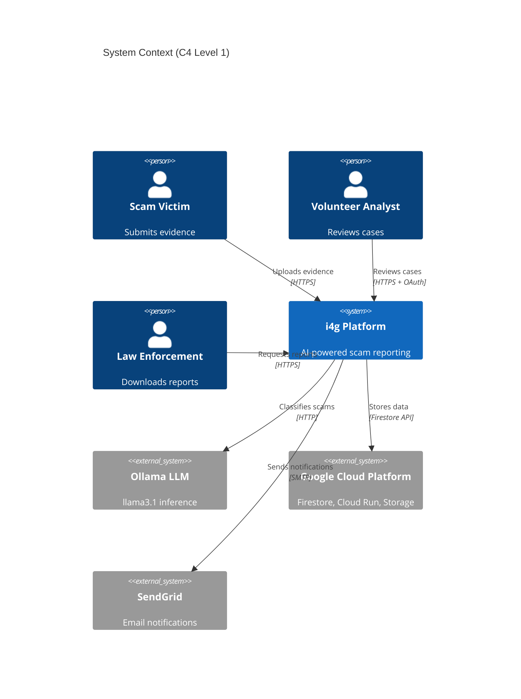
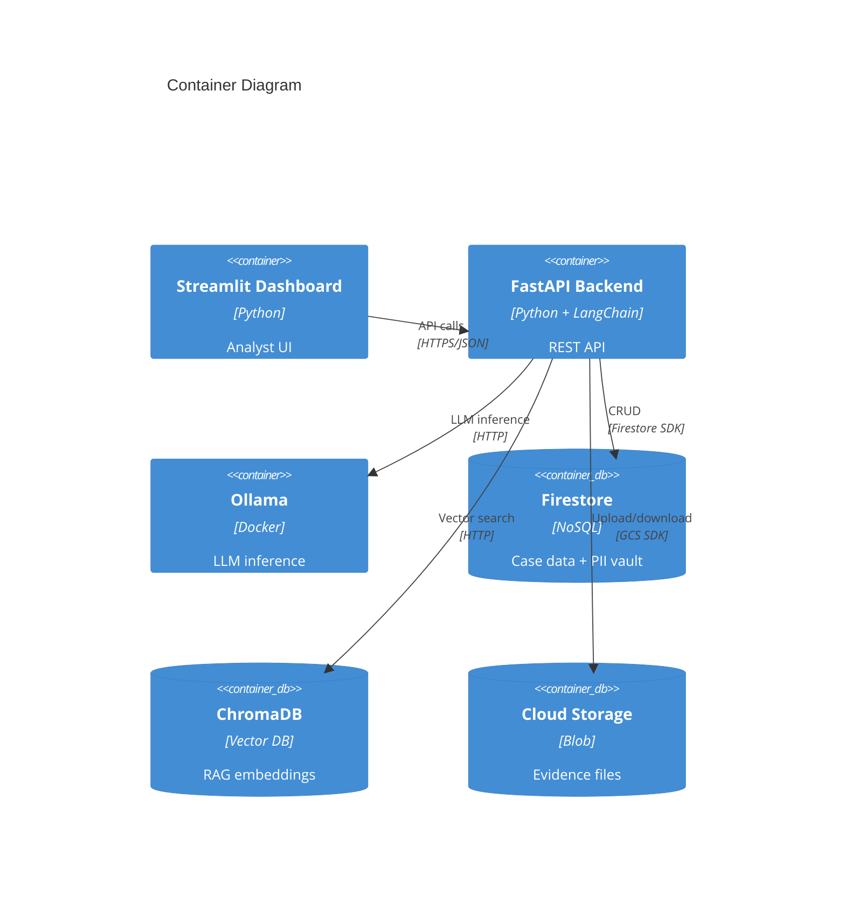
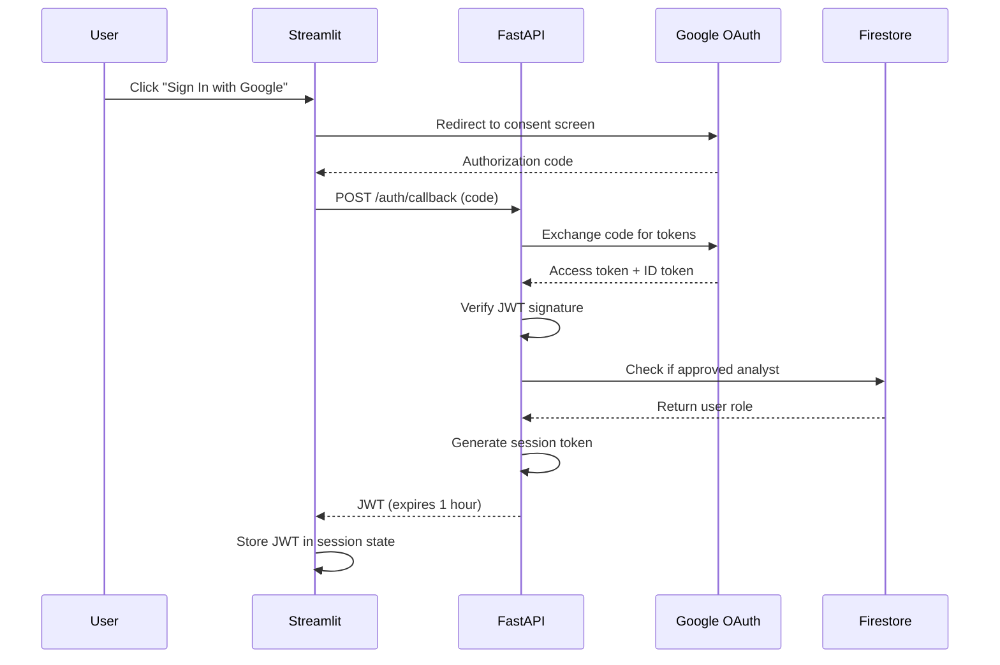

# Technical Design Document: i4g Production System

> **Version**: 1.0  
> **Last Updated**: October 30, 2025  
> **Owner**: Jerry Soung  
> **Status**: Design → Implementation

---

## Document Purpose

This Technical Design Document (TDD) provides implementation-level details for the **i4g production system**. It translates the requirements from the [Production PRD](./prd_production.md) into concrete technical specifications, API contracts, database schemas, and deployment procedures.

**Intended Audience**: Software engineers, DevOps, security auditors

---

## System Architecture

### High-Level C4 Context Diagram



---

### Container Diagram (C4 Level 2)



---

## API Specifications

### Base URL
- **Production**: `https://api.i4g.org`
- **Staging**: `https://api-staging.i4g.org`

### Authentication
All authenticated endpoints require:
```
Authorization: Bearer <JWT_TOKEN>
```

JWT payload:
```json
{
  "sub": "google_oauth_uid",
  "email": "analyst@university.edu",
  "role": "analyst",
  "exp": 1699024800
}
```

---

### Endpoint: `POST /api/cases`

**Description**: Submit a new scam case

**Authentication**: Optional (victims don't need accounts)

**Request Body**:
```json
{
  "title": "Romance scam - lost $10K",
  "description": "I met someone on a dating app. They asked for money...",
  "victim_email": "victim@example.com",
  "evidence_files": [
    {
      "filename": "chat_screenshot.png",
      "content": "base64_encoded_data",
      "mime_type": "image/png"
    }
  ]
}
```

**Response** (201 Created):
```json
{
  "case_id": "uuid-v4",
  "status": "pending_review",
  "created_at": "2025-10-30T12:00:00Z",
  "message": "Case submitted successfully. You will receive an email when reviewed."
}
```

**PII Tokenization Flow**:
1. Extract PII from `description` using regex + LLM
2. Encrypt PII with AES-256-GCM → store in `/pii_vault`
3. Replace PII in description with tokens: `<PII:SSN:7a8f2e>`
4. Store tokenized case in `/cases`

---

### Endpoint: `GET /api/cases`

**Description**: List cases assigned to authenticated analyst

**Authentication**: Required (analyst or admin)

**Query Parameters**:
- `status` (optional): Filter by `pending_review`, `in_progress`, `resolved`
- `limit` (default: 20): Max results per page
- `offset` (default: 0): Pagination offset

**Response** (200 OK):
```json
{
  "cases": [
    {
      "case_id": "uuid-v4",
      "title": "Romance scam - lost $10K",
      "status": "pending_review",
      "created_at": "2025-10-30T12:00:00Z",
      "classification": {
        "type": "Romance Scam",
        "confidence": 0.92
      }
    }
  ],
  "total": 42,
  "limit": 20,
  "offset": 0
}
```

**Note**: `description` field is NOT included in list view (performance). Use `GET /api/cases/{case_id}` for full details.

---

### Endpoint: `GET /api/cases/{case_id}`

**Description**: Get full case details (PII masked for analysts)

**Authentication**: Required

**Response** (200 OK):
```json
{
  "case_id": "uuid-v4",
  "title": "Romance scam - lost $10K",
  "description": "I met someone on a dating app. My SSN is ███████ and I sent $10,000 to...",
  "victim_email": "victim@example.com",
  "status": "pending_review",
  "assigned_to": "analyst_uid_123",
  "classification": {
    "type": "Romance Scam",
    "confidence": 0.92,
    "llm_model": "llama3.1"
  },
  "evidence_files": [
    {
      "filename": "chat_screenshot.png",
      "url": "https://storage.googleapis.com/i4g-evidence/2025/10/30/abc123.png",
      "mime_type": "image/png",
      "size_bytes": 102400
    }
  ],
  "notes": [
    {
      "author": "analyst_uid_123",
      "author_name": "Jane Doe",
      "text": "Verified wire transfer receipt. Scammer used fake profile.",
      "timestamp": "2025-10-30T14:30:00Z"
    }
  ],
  "created_at": "2025-10-30T12:00:00Z",
  "updated_at": "2025-10-30T14:30:00Z"
}
```

**PII Masking Logic**:
- Analysts see: `███████` (7 black squares)
- Admins see: `<PII:SSN:7a8f2e>` (token for debugging)
- LEO reports see: `123-45-6789` (real PII with victim consent)

---

### Endpoint: `PATCH /api/cases/{case_id}`

**Description**: Update case status or assignment

**Authentication**: Required (analyst or admin)

**Request Body**:
```json
{
  "status": "in_progress",
  "assigned_to": "analyst_uid_456"
}
```

**Response** (200 OK):
```json
{
  "case_id": "uuid-v4",
  "status": "in_progress",
  "assigned_to": "analyst_uid_456",
  "updated_at": "2025-10-30T15:00:00Z"
}
```

---

### Endpoint: `POST /api/cases/{case_id}/notes`

**Description**: Add analyst note to case

**Authentication**: Required

**Request Body**:
```json
{
  "text": "Verified wire transfer receipt. Recommend contacting bank."
}
```

**Response** (201 Created):
```json
{
  "note_id": "uuid-v4",
  "author": "analyst_uid_123",
  "author_name": "Jane Doe",
  "text": "Verified wire transfer receipt...",
  "timestamp": "2025-10-30T15:30:00Z"
}
```

---

### Endpoint: `POST /api/cases/{case_id}/approve`

**Description**: Approve case and generate LEO report

**Authentication**: Required (analyst or admin)

**Request Body**:
```json
{
  "victim_consent": true
}
```

**Response** (200 OK):
```json
{
  "case_id": "uuid-v4",
  "status": "resolved",
  "report_url": "https://storage.googleapis.com/i4g-reports/2025/10/30/case_uuid.pdf",
  "report_generated_at": "2025-10-30T16:00:00Z"
}
```

**Implementation Steps**:
1. Verify analyst has access to case
2. Fetch encrypted PII from `/pii_vault`
3. Decrypt PII
4. Generate PDF report with real PII
5. Upload PDF to Cloud Storage
6. Email victim with secure download link
7. Update case status to `resolved`

---

### Endpoint: `GET /api/cases/{case_id}/export`

**Description**: GDPR-compliant data export

**Authentication**: Optional (victim can use email-based token)

**Response** (200 OK):
```json
{
  "case_id": "uuid-v4",
  "exported_at": "2025-10-30T16:30:00Z",
  "data": {
    "title": "Romance scam - lost $10K",
    "description": "Full description with real PII (not tokens)",
    "evidence_files": ["url1", "url2"],
    "notes": [...],
    "created_at": "2025-10-30T12:00:00Z"
  }
}
```

---

### Endpoint: `DELETE /api/cases/{case_id}`

**Description**: GDPR-compliant hard delete

**Authentication**: Required (victim or admin)

**Response** (204 No Content)

**Implementation Steps**:
1. Delete from Firestore `/cases` collection
2. Delete all PII from `/pii_vault` where `case_id` matches
3. Delete evidence files from Cloud Storage
4. Delete vector embeddings from ChromaDB
5. Log deletion in audit trail

---

## PII Tokenization Implementation

### Regex Patterns

```python
PII_PATTERNS = {
    "ssn": r"\b\d{3}-\d{2}-\d{4}\b",
    "email": r"\b[A-Za-z0-9._%+-]+@[A-Za-z0-9.-]+\.[A-Z|a-z]{2,}\b",
    "phone": r"\b(\+\d{1,2}\s?)?\(?\d{3}\)?[\s.-]?\d{3}[\s.-]?\d{4}\b",
    "credit_card": r"\b\d{4}[\s-]?\d{4}[\s-]?\d{4}[\s-]?\d{4}\b",
    "address": r"\b\d+\s+[\w\s]+(?:Street|St|Avenue|Ave|Road|Rd|Boulevard|Blvd)\b",
    "dob": r"\b\d{1,2}/\d{1,2}/\d{4}\b",
}
```

### LLM-Assisted Extraction

For contextual PII (e.g., "my social is 123-45-6789"), use LLM:

**Prompt**:
```python
prompt = f"""
Extract all personally identifiable information (PII) from the following text.
Return only JSON with keys: ssn, email, phone, credit_card, address, dob.
If a type is not present, omit the key.

Text: {user_input}

JSON:
"""

response = ollama.chat(model="llama3.1", messages=[{"role": "user", "content": prompt}])
pii = json.loads(response['message']['content'])
```

**Example**:
```json
{
  "ssn": "123-45-6789",
  "email": "victim@example.com",
  "phone": "(555) 123-4567"
}
```

### Encryption

```python
from cryptography.fernet import Fernet
import os

# Load encryption key from Secret Manager
encryption_key = os.getenv("TOKEN_ENCRYPTION_KEY")
cipher = Fernet(encryption_key)

def encrypt_pii(plaintext: str) -> bytes:
    return cipher.encrypt(plaintext.encode())

def decrypt_pii(ciphertext: bytes) -> str:
    return cipher.decrypt(ciphertext).decode()
```

### Token Format

```
<PII:{TYPE}:{HASH}>

Examples:
- <PII:SSN:7a8f2e>
- <PII:EMAIL:9b1c4d>
- <PII:PHONE:3e5f8a>
```

**Hash Generation**:
```python
import hashlib

def generate_token(pii_value: str, pii_type: str) -> str:
    hash_obj = hashlib.sha256(pii_value.encode())
    hash_hex = hash_obj.hexdigest()[:6]  # First 6 chars
    return f"<PII:{pii_type.upper()}:{hash_hex}>"
```

---

## OAuth 2.0 Implementation

### Google Sign-In Flow



### FastAPI Implementation

```python
from fastapi import FastAPI, Depends, HTTPException
from fastapi.security import OAuth2PasswordBearer
from google.oauth2 import id_token
from google.auth.transport import requests

app = FastAPI()
oauth2_scheme = OAuth2PasswordBearer(tokenUrl="token")

async def get_current_user(token: str = Depends(oauth2_scheme)):
    try:
        # Verify JWT
        idinfo = id_token.verify_oauth2_token(
            token, 
            requests.Request(), 
            os.getenv("GOOGLE_CLIENT_ID")
        )
        
        # Check if user is approved analyst
        user_doc = db.collection("analysts").document(idinfo['sub']).get()
        if not user_doc.exists or not user_doc.to_dict().get('approved'):
            raise HTTPException(status_code=403, detail="Not an approved analyst")
        
        return {
            "uid": idinfo['sub'],
            "email": idinfo['email'],
            "role": user_doc.to_dict().get('role', 'analyst')
        }
    except ValueError:
        raise HTTPException(status_code=401, detail="Invalid token")

@app.get("/api/cases")
async def list_cases(user: dict = Depends(get_current_user)):
    # user is guaranteed to be authenticated and approved
    cases = db.collection("cases").where("assigned_to", "==", user['uid']).stream()
    return {"cases": [case.to_dict() for case in cases]}
```

---

## Firestore Schema

### Collection: `/cases`

```typescript
interface Case {
  case_id: string;  // Firestore document ID
  created_at: Timestamp;
  updated_at: Timestamp;
  
  // Victim info
  victim_email: string;
  title: string;
  description: string;  // Contains PII tokens: <PII:SSN:7a8f2e>
  
  // Classification
  classification: {
    type: "Romance Scam" | "Crypto Scam" | "Phishing" | "Other";
    confidence: number;  // 0.0 - 1.0
    llm_model: string;   // "llama3.1"
  };
  
  // Status
  status: "pending_review" | "in_progress" | "resolved" | "archived";
  assigned_to: string | null;  // analyst UID
  
  // Evidence
  evidence_files: Array<{
    filename: string;
    url: string;  // gs:// URL
    mime_type: string;
    size_bytes: number;
  }>;
  
  // Analyst notes
  notes: Array<{
    author: string;  // analyst UID
    author_name: string;
    text: string;
    timestamp: Timestamp;
  }>;
  
  // Lifecycle
  resolved_at: Timestamp | null;
  archived: boolean;
}
```

**Indexes**:
```bash
gcloud firestore indexes create \
  --collection-group=cases \
  --field-config field-path=assigned_to,order=ascending \
  --field-config field-path=created_at,order=descending
```

---

### Collection: `/pii_vault`

```typescript
interface PIIVaultEntry {
  token: string;  // e.g., "7a8f2e" (Firestore document ID)
  case_id: string;
  pii_type: "ssn" | "email" | "phone" | "credit_card" | "address" | "dob";
  encrypted_value: Uint8Array;  // AES-256-GCM ciphertext
  encryption_key_version: string;  // "20251030" (for key rotation)
  created_at: Timestamp;
}
```

**Security Rules**:
```javascript
rules_version = '2';
service cloud.firestore {
  match /databases/{database}/documents {
    // Only backend service account can access PII vault
    match /pii_vault/{token} {
      allow read, write: if request.auth.token.email == 'i4g-backend@i4g-prod.iam.gserviceaccount.com';
    }
  }
}
```

---

### Collection: `/analysts`

```typescript
interface Analyst {
  uid: string;  // Google OAuth UID (Firestore document ID)
  email: string;
  full_name: string;
  role: "analyst" | "admin";
  approved: boolean;  // Must be true to access cases
  ferpa_certified: boolean;
  last_login: Timestamp;
  created_at: Timestamp;
}
```

---

## Security Design

### STRIDE Threat Model

| Threat | Mitigation |
|--------|------------|
| **Spoofing** | OAuth 2.0 (Google trusted provider), JWT signatures |
| **Tampering** | Firestore rules, TLS 1.3, read-only API for victims |
| **Repudiation** | Audit logs (all `/pii_vault` access logged) |
| **Information Disclosure** | PII tokenization, encryption at rest, HTTPS |
| **Denial of Service** | Cloud Armor (DDoS protection), rate limiting |
| **Elevation of Privilege** | Firestore rules, role-based access control |

---

### Firestore Security Rules

```javascript
rules_version = '2';
service cloud.firestore {
  match /databases/{database}/documents {
    // Analysts can only read assigned cases
    match /cases/{case_id} {
      allow read: if request.auth != null && 
                     (resource.data.assigned_to == request.auth.uid || 
                      get(/databases/$(database)/documents/analysts/$(request.auth.uid)).data.role == 'admin');
      
      allow update: if request.auth != null &&
                       resource.data.assigned_to == request.auth.uid;
    }
    
    // Analysts collection is read-only for analysts
    match /analysts/{uid} {
      allow read: if request.auth != null;
      allow write: if request.auth != null && 
                      get(/databases/$(database)/documents/analysts/$(request.auth.uid)).data.role == 'admin';
    }
    
    // PII vault is locked to backend service account
    match /pii_vault/{token} {
      allow read, write: if request.auth.token.email == 'i4g-backend@i4g-prod.iam.gserviceaccount.com';
    }
  }
}
```

---

### Encryption

**At Rest**:
- Firestore: Automatic encryption (AES-256)
- Cloud Storage: Customer-managed encryption keys (CMEK)
- PII Vault: Additional AES-256-GCM layer

**In Transit**:
- All API calls: TLS 1.3
- Cloud Run: HTTPS only (HTTP redirects to HTTPS)

---

## Monitoring & Observability

### Structured Logging

```python
import logging
import json
from uuid import uuid4

logger = logging.getLogger(__name__)

def log_event(action: str, user_id: str, metadata: dict):
    log_entry = {
        "timestamp": datetime.utcnow().isoformat(),
        "severity": "INFO",
        "correlation_id": str(uuid4()),
        "user_id": user_id,
        "action": action,
        "metadata": metadata
    }
    logger.info(json.dumps(log_entry))

# Usage
log_event("case_approved", user['uid'], {"case_id": case_id, "classification": "Romance Scam"})
```

**Log Output**:
```json
{
  "timestamp": "2025-10-30T12:00:00Z",
  "severity": "INFO",
  "correlation_id": "uuid-v4",
  "user_id": "analyst_uid_123",
  "action": "case_approved",
  "metadata": {
    "case_id": "uuid-v4",
    "classification": "Romance Scam"
  }
}
```

---

### Custom Metrics

```python
from google.cloud import monitoring_v3

client = monitoring_v3.MetricServiceClient()
project_name = f"projects/{os.getenv('GCP_PROJECT_ID')}"

def record_pii_vault_access(case_id: str):
    series = monitoring_v3.TimeSeries()
    series.metric.type = "custom.googleapis.com/i4g/pii_vault_access"
    series.resource.type = "global"
    
    point = monitoring_v3.Point()
    point.value.int64_value = 1
    point.interval.end_time = datetime.utcnow()
    
    series.points = [point]
    client.create_time_series(name=project_name, time_series=[series])
```

---

### Alerting Policies

**Error Rate Alert**:
```yaml
displayName: "High Error Rate"
conditions:
  - displayName: "5xx errors > 5% for 5 minutes"
    conditionThreshold:
      filter: 'resource.type="cloud_run_revision" AND metric.type="run.googleapis.com/request_count" AND metric.labels.response_code_class="5xx"'
      comparison: COMPARISON_GT
      thresholdValue: 0.05
      duration: 300s
notificationChannels:
  - "projects/i4g-prod/notificationChannels/email-jerry"
```

---

## CI/CD Pipeline

### GitHub Actions Workflow

```yaml
name: CI/CD
on:
  push:
    branches: [main]
  pull_request:
    branches: [main]

jobs:
  test:
    runs-on: ubuntu-latest
    steps:
      - uses: actions/checkout@v3
      
      - uses: actions/setup-python@v4
        with:
          python-version: '3.11'
      
      - name: Install dependencies
        run: |
          pip install -e ".[dev]"
      
      - name: Run linters
        run: |
          black --check src/ tests/
          isort --check src/ tests/
          mypy src/
      
      - name: Run tests
        run: |
          pytest tests/ --cov=src/i4g --cov-report=xml
      
      - name: Upload coverage
        uses: codecov/codecov-action@v3
        with:
          files: ./coverage.xml

  deploy:
    needs: test
    if: github.ref == 'refs/heads/main'
    runs-on: ubuntu-latest
    steps:
      - uses: actions/checkout@v3
      
      - uses: google-github-actions/setup-gcloud@v1
        with:
          service_account_key: ${{ secrets.GCP_SA_KEY }}
          project_id: i4g-prod
      
      - name: Build Docker image
        run: |
          docker build -t gcr.io/i4g-prod/api:${{ github.sha }} .
          docker tag gcr.io/i4g-prod/api:${{ github.sha }} gcr.io/i4g-prod/api:latest
      
      - name: Push to GCR
        run: |
          gcloud auth configure-docker
          docker push gcr.io/i4g-prod/api:${{ github.sha }}
          docker push gcr.io/i4g-prod/api:latest
      
      - name: Deploy to Cloud Run
        run: |
          gcloud run deploy i4g-api \
            --image gcr.io/i4g-prod/api:${{ github.sha }} \
            --region us-central1 \
            --platform managed \
            --allow-unauthenticated \
            --max-instances 10 \
            --memory 1Gi \
            --set-env-vars "ENVIRONMENT=production"
```

---

## Deployment Procedures

### Initial Setup

```bash
# 1. Create GCP project
gcloud projects create i4g-prod --name="i4g Production"

# 2. Enable APIs
gcloud services enable \
  run.googleapis.com \
  firestore.googleapis.com \
  storage.googleapis.com \
  secretmanager.googleapis.com \
  logging.googleapis.com \
  monitoring.googleapis.com

# 3. Create Firestore database
gcloud firestore databases create --region=us-central1

# 4. Create Cloud Storage bucket
gsutil mb -l us-central1 gs://i4g-evidence
gsutil mb -l us-central1 gs://i4g-reports

# 5. Create encryption key in Secret Manager
echo -n "$(python -c 'from cryptography.fernet import Fernet; print(Fernet.generate_key().decode())')" | \
  gcloud secrets create TOKEN_ENCRYPTION_KEY --data-file=-

# 6. Create service account
gcloud iam service-accounts create i4g-backend \
  --display-name="i4g Backend Service Account"

# 7. Grant Firestore permissions
gcloud projects add-iam-policy-binding i4g-prod \
  --member="serviceAccount:i4g-backend@i4g-prod.iam.gserviceaccount.com" \
  --role="roles/datastore.user"
```

---

### Deploy to Cloud Run

```bash
# 1. Build Docker image
docker build -t gcr.io/i4g-prod/api:v1.0.0 .

# 2. Push to Google Container Registry
docker push gcr.io/i4g-prod/api:v1.0.0

# 3. Deploy to Cloud Run
gcloud run deploy i4g-api \
  --image gcr.io/i4g-prod/api:v1.0.0 \
  --region us-central1 \
  --platform managed \
  --allow-unauthenticated \
  --service-account i4g-backend@i4g-prod.iam.gserviceaccount.com \
  --max-instances 10 \
  --memory 1Gi \
  --timeout 300 \
  --set-env-vars "FIRESTORE_PROJECT_ID=i4g-prod,ENVIRONMENT=production" \
  --set-secrets "TOKEN_ENCRYPTION_KEY=TOKEN_ENCRYPTION_KEY:latest"

# 4. Get deployed URL
gcloud run services describe i4g-api --region us-central1 --format 'value(status.url)'
```

---

## Testing Strategy

### Unit Tests (80% coverage target)

```python
# tests/unit/test_pii_tokenizer.py
import pytest
from i4g.security.pii import tokenize_pii, decrypt_token

def test_ssn_tokenization():
    text = "My SSN is 123-45-6789"
    result = tokenize_pii(text)
    
    assert "ssn" in result["tokens"]
    assert "123-45-6789" not in result["tokenized_text"]
    assert "<PII:SSN:" in result["tokenized_text"]

def test_email_tokenization():
    text = "Contact me at victim@example.com"
    result = tokenize_pii(text)
    
    assert "email" in result["tokens"]
    assert "victim@example.com" not in result["tokenized_text"]

def test_multiple_pii_types():
    text = "SSN: 123-45-6789, Email: victim@example.com, Phone: (555) 123-4567"
    result = tokenize_pii(text)
    
    assert len(result["tokens"]) == 3
    assert "ssn" in result["tokens"]
    assert "email" in result["tokens"]
    assert "phone" in result["tokens"]
```

---

### Integration Tests

```python
# tests/integration/test_case_workflow.py
import pytest
from fastapi.testclient import TestClient
from i4g.api.app import app

client = TestClient(app)

def test_case_submission_to_approval():
    # 1. Submit case
    response = client.post("/api/cases", json={
        "title": "Test scam",
        "description": "My SSN is 123-45-6789",
        "victim_email": "test@example.com"
    })
    assert response.status_code == 201
    case_id = response.json()["case_id"]
    
    # 2. Analyst retrieves case (PII should be masked)
    analyst_token = get_test_jwt(role="analyst")
    response = client.get(
        f"/api/cases/{case_id}",
        headers={"Authorization": f"Bearer {analyst_token}"}
    )
    assert response.status_code == 200
    assert "███████" in response.json()["description"]
    assert "123-45-6789" not in response.json()["description"]
    
    # 3. Analyst approves case
    response = client.post(
        f"/api/cases/{case_id}/approve",
        headers={"Authorization": f"Bearer {analyst_token}"},
        json={"victim_consent": True}
    )
    assert response.status_code == 200
    assert "report_url" in response.json()
```

---

## Performance Benchmarks

### Load Testing (Locust)

```python
# locustfile.py
from locust import HttpUser, task, between

class I4GUser(HttpUser):
    wait_time = between(1, 3)
    
    @task(3)
    def list_cases(self):
        self.client.get("/api/cases", headers={"Authorization": f"Bearer {self.token}"})
    
    @task(1)
    def view_case(self):
        self.client.get(f"/api/cases/{self.case_id}", headers={"Authorization": f"Bearer {self.token}"})
    
    def on_start(self):
        # Authenticate
        response = self.client.post("/auth/login", json={...})
        self.token = response.json()["access_token"]
        self.case_id = "test-case-id"
```

**Target Performance**:
- 20 concurrent users
- p95 latency < 2 seconds
- Error rate < 1%

---

## Disaster Recovery

### Backup Strategy

```bash
# Daily Firestore export (Cloud Scheduler cron job)
gcloud firestore export gs://i4g-backups/$(date +%Y%m%d) \
  --collection-ids=cases,analysts,pii_vault

# Retention: 7 days
gsutil lifecycle set lifecycle.json gs://i4g-backups
```

**lifecycle.json**:
```json
{
  "lifecycle": {
    "rule": [
      {
        "action": {"type": "Delete"},
        "condition": {"age": 7}
      }
    ]
  }
}
```

---

### Recovery Procedures

**Scenario 1: Accidental case deletion**

```bash
# 1. Find latest backup
gsutil ls gs://i4g-backups/

# 2. Import backup
gcloud firestore import gs://i4g-backups/20251030/
```

**Scenario 2: PII vault corruption**

```python
# 1. Stop API (prevent further writes)
gcloud run services update i4g-api --no-traffic

# 2. Restore from backup
gcloud firestore import gs://i4g-backups/20251030/ --collection-ids=pii_vault

# 3. Validate restoration
python scripts/validate_pii_vault.py

# 4. Resume traffic
gcloud run services update i4g-api --traffic
```

---

## Appendix: Environment Variables

```bash
# Production (.env)
ENVIRONMENT=production
GCP_PROJECT_ID=i4g-prod
FIRESTORE_PROJECT_ID=i4g-prod
GOOGLE_CLIENT_ID=xxx.apps.googleusercontent.com
GOOGLE_CLIENT_SECRET=xxx  # Stored in Secret Manager
TOKEN_ENCRYPTION_KEY=xxx  # Stored in Secret Manager
OLLAMA_BASE_URL=http://ollama:11434
SENDGRID_API_KEY=xxx  # Stored in Secret Manager
LOG_LEVEL=INFO
```

---

## Contact

**Technical Lead**: Jerry Soung (jerry@i4g.org)  
**Repository**: https://github.com/jsoung/i4g  
**Documentation**: https://github.com/jsoung/i4g/tree/main/docs

---

**Last Updated**: 2025-10-30  
**Next Review**: 2025-11-30
